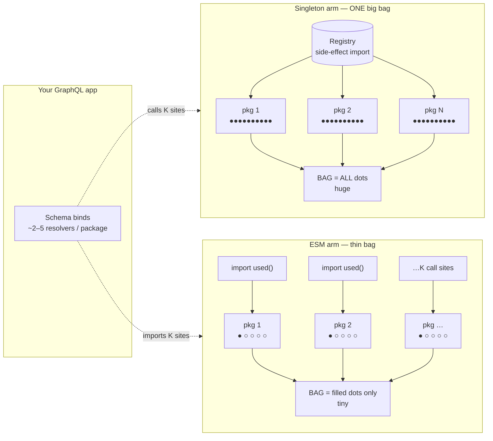

# ESM tree-shake lab

[](https://github.com/atiq-playground/esm-treeshake-lab/actions/workflows/ci.yml)
[](https://github.com/atiq-playground/esm-treeshake-lab/releases/tag/v0.6.1)
[](package.json)
[](LICENSE)

**What this is**  
A Nx + Bun lab that **measures** singleton-plugin packaging vs ESM selective imports (scale bench at N), and explains the numbers with **Fumadocs**.

**Focus**  
Metrics only: bytes, unused markers, build time. No auth / identity demo.

## The idea in one picture

Same GraphQL app, same ~2–5 resolvers per package — registry packaging ships **every** export; selective ESM keeps only what you call.



**If this helped you, drop a [follow](https://github.com/noonii) and a [star on GitHub](https://github.com/atiq-playground/esm-treeshake-lab)! I would really appreciate it.**

[](https://github.com/atiq-playground/esm-treeshake-lab)

## Layout

| Path | Role |
|------|------|
| `apps/docs` | Fumadocs site (metrics, why, run, research) |
| `packages/lab/*` | `@lab/singleton-services`, smoke stubs, generated stubs |
| `scripts/lab/*` | generate + esbuild bench |
| `docs/lab/benchmark-*.latest.*` | Case reports (UC1 = `benchmark-latest.*`) |

## Getting started

```bash
bun install
bun run lab:bench:smoke
bun run dev          # docs at http://localhost:3000
```

## Scale bench

Compares **global singleton plugins** (import all N → register) vs **ESM** (import only what you call). Host: **esbuild**.

**Published vs CI:** Homepage / Quick Facts cite committed `docs/lab/benchmark-*-latest.*` at research scale (UC1–UC4 **N=100** landing-shaped, fleet **N=50×M=100**, coldstart **N=50**, 3p **N=100**). `lab:bench:smoke` is CI-only (N=3 asserts) and **does not** overwrite those artifacts.

**Surface vs call sites:** `--fns` = functions *defined* per package. `--used=K` = resolvers bound (1 fn ≈ 1 field). Landing uses ~2–5/pkg, not a single toy import.

| Case | Command | Surface / graph | ESM call sites | Report |
|------|---------|-----------------|----------------|--------|
| UC1 baseline | `lab:bench -- --n=100 --used=200` | 2 fns/svc | **K** (landing **~2/pkg**) | `benchmark-latest.*` (home) |
| UC2 wide | `lab:bench:wide -- --n=100 --used=300` | `--fns=20` | **K** (landing **~3/pkg**) | `benchmark-wide-latest.*` |
| UC3 cycles | `lab:bench:cycles -- --n=100 --used=300` | wide + package ring | **K** (landing **~3/pkg**) | `benchmark-cycles-latest.*` |
| UC4 partial | `lab:bench:partial -- --n=100 --used=500` | `--fns` surface; needs K | **K** (landing **~5/pkg**) | `benchmark-partial-latest.*` |
| Third-party ballast | `lab:bench:thirdparty -- --n=100` | UC1 surface + stub `@lab/3p-*` | **1** (svc-0) | `benchmark-thirdparty-latest.*` |
| Real npm 3p | `lab:bench:thirdparty:real -- --n=100` | pinned graphql + unused SDK extras | **1** (svc-0) | `benchmark-thirdparty-real-latest.*` |
| Multi-consumer fleet | `lab:bench:fleet -- --n=50 --consumers=100` | UC1 × M (naive + shared multi-entry) | **1** per app | `benchmark-fleet-latest.*` |
| Cold start / RSS | `lab:bench:coldstart` (default **N=50**) | Node import ms + RSS | generated fixtures | `benchmark-coldstart-latest.*` |
| Realistic GraphQL pipeline | `lab:bench:realistic` (+ `lab:bench:request`; GHA `lab-realistic-bench`) | cycles + real 3p; ~10 call sites/pkg | **1000** (even, no `--seed`) | `benchmark-realistic-latest.*` |

**Smoke (CI only): UC1 N=3 — asserts, no published overwrite**

```bash
bun run lab:bench:smoke
```

**Full local (landing-shaped: ~2–5 resolvers per domain package)**

```bash
# 1 fn ≈ 1 GraphQL field resolver — published homepage defaults
bun run lab:bench -- --n=100 --used=200          # ~2/pkg (lean surface)
bun run lab:bench:wide -- --n=100 --used=300     # ~3/pkg of ~20
bun run lab:bench:cycles -- --n=100 --used=300
bun run lab:bench:partial -- --n=100 --used=500  # ~5/pkg of ~20

# optional: shuffle which K surface fns (reproducible)
bun run lab:bench:partial -- --n=100 --used=500 --seed=42

# growth ladder (org-scale; longer generate + install)
bun run lab:bench -- --n=500 --used=1000
bun run lab:bench -- --n=1000 --used=2000
# full N × use-case practicality sweep → docs/research/scale-bench-sweep.json
bun run lab:probe:scale

# extended datapoints (sibling reports; defaults are research-scale)
bun run lab:bench:thirdparty -- --n=100
bun run lab:bench:thirdparty -- --n=3 --3p-count=2 --3p-bytes=2048   # tiny local check
bun run lab:bench:thirdparty:real -- --n=100                          # pinned npm graphql stack
bun run lab:bench:fleet -- --n=50 --consumers=100                     # naive ×M + shared multi-entry
bun run lab:bench:coldstart                                           # Node import ms + RSS @ N=50
bun run lab:bench:coldstart -- --n=3                                  # smoke assert only
```

Variants never overwrite `benchmark-latest.*` (docs home stays on UC1). Smoke / `--n=3` coldstart write under `tmp/` only.

**Outputs**

| Output | Use |
|--------|-----|
| Terminal report | Screenshot-friendly summary |
| `docs/lab/benchmark-latest.*` | UC1: home + PRs |
| `docs/lab/benchmark-wide-latest.*` | UC2 |
| `docs/lab/benchmark-cycles-latest.*` | UC3 |
| `docs/lab/benchmark-partial-latest.*` | UC4 |
| `docs/lab/benchmark-thirdparty-latest.*` | Stub 3p ballast |
| `docs/lab/benchmark-thirdparty-real-latest.*` | Real pinned npm 3p |
| `docs/lab/benchmark-fleet-latest.*` | Fleet naive ×M + shared multi-entry |
| `docs/lab/benchmark-coldstart-latest.*` | Node cold import + RSS |
| `docs/lab/benchmark-realistic-latest.*` | Realistic GraphQL pipeline + request (GHA proof) |

**Realistic Last verified:** 2026-07-28T19:12:28.746Z ([run](https://github.com/atiq-playground/esm-treeshake-lab/actions/runs/30390892661))

## Scripts

| Script | What it does |
|--------|----------------|
| `dev` | Fumadocs (`@apps/docs`) |
| `build` | Next build docs |
| `preview` | OpenNext build + local Workers runtime |
| `deploy` | OpenNext build + deploy to Cloudflare Workers |
| `lab:generate` | Generate N singleton + ESM stub packages |
| `lab:bench:smoke` | CI-only UC1 N=3 asserts (does **not** overwrite `docs/lab` latest) |
| `lab:bench` | UC1 full scale bench (default N=100) |
| `lab:bench:wide` | UC2: many fns/svc defined (ESM still calls 1) |
| `lab:bench:cycles` | UC3: wide + cyclic package ring |
| `lab:bench:partial` | UC4: both arms call `--used=K` sites |
| `lab:bench:thirdparty` | Stub third-party ballast (`@lab/3p-*`) + first-party graph |
| `lab:bench:thirdparty:real` | Real pinned npm 3p (`--3p=real`: graphql + SDK extras) |
| `lab:bench:fleet` | Multi-consumer fleet (`--fleet-mode=both`: naive ×M + shared) |
| `lab:bench:coldstart` | Node cold import + RSS (default N=50; `--n=3` smoke → tmp only) |
| `lab:bench:realistic` | Realistic GraphQL-shaped preset (cycles + real 3p; sibling report) |
| `lab:bench:request` | Node HTTP request-time load against realistic bundles |
| `lab:probe:scale` | N × UC practicality sweep → `docs/research/scale-bench-sweep.json` |

## Map

Planning map (destination met): [Singleton vs ESM scale bench](https://github.com/atiq-playground/esm-treeshake-lab/issues/15).

Realistic GraphQL pipeline bench: [#35](https://github.com/atiq-playground/esm-treeshake-lab/issues/35).

## Support

If this helped you, drop a [follow](https://github.com/noonii) and a [star on GitHub](https://github.com/atiq-playground/esm-treeshake-lab)! I would really appreciate it.
